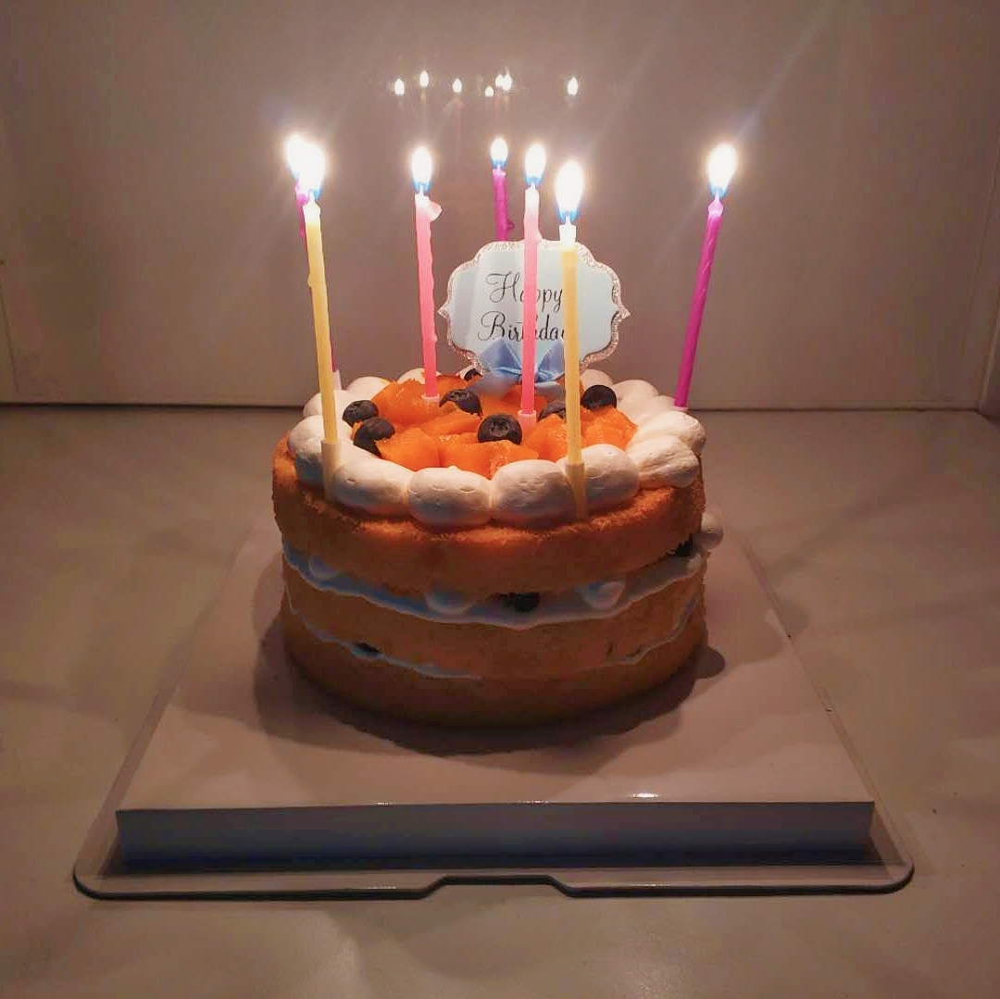
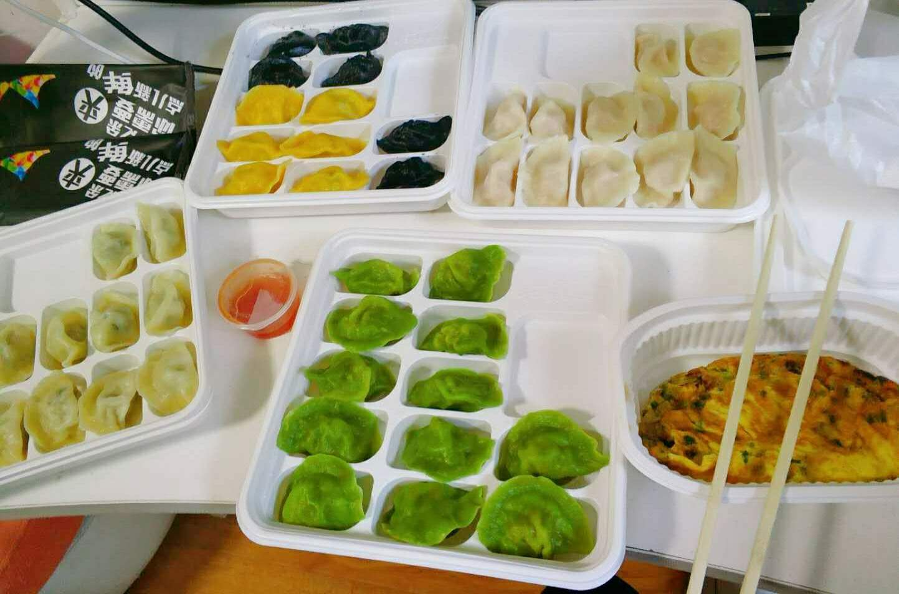

过了今天，我就开始了人生的第二十六个年头了。

为了保持一点仪式感，总觉得应该写点什么。可是想了半天也不知道写点什么好，只好胡言乱语一把。

半个小时前，我给蛋糕插上了蜡烛，自己许了几个愿又吹灭了。

愿望不少，足有三个，估计灯神得忙一阵子。不过我给了它三年期限，时间倒是充裕的很。这么一想，我相当于预支了未来两个生日愿望了，而且还放宽了顺序要求，也算是减轻了一点灯神的负担。

第三个愿望是我临时加上去的。

三个小时前，我刚刚结束今日丰盛的晚餐。

鉴于食材和能力的限制，在北京隔离的这两周里，我不得不循环重复播放几种菜品。三天前食材接近耗尽，只好每天下面并以外卖作为补充。今日生日，借此良机自然要改善伙食，于是两人点了四份水饺，以至于腹内饱胀。本想将蛋糕留于明日，后一思索，生日蛋糕不在生日当天吃总是有些奇怪，只好再准备点上蜡烛、切下一小块当作夜宵。
一晚之内吃这么多，足以抵消我数日的锻炼成果。某人建议我在愿望里加入一条不要长胖，我从善如流。第三个愿望就这么来的。

半个月前，我带上行李从家出发回到北京。

我想了半天，我这应该算是来到北京，还是回到北京。我租的房子就在海淀，离学校不远的地方。在京上学七年半，我对这附近的熟悉程度也不下于家里了。自从家里搬家之后，我回家时间甚少，基本只有每年寒暑假时候能回去几天。自从上了硕士，假期时间短了不少，每次回家待的时间就更短了。因此我反而对家附近不甚熟悉。从这个角度上说，我更像是回到北京。

三个月前面临毕业，一切都是匆匆忙忙的。

我匆匆忙忙的完成了毕业答辩，匆匆忙忙的售卖二手物品、收拾搬运行李；匆匆忙忙的拍毕业照、参加毕业典礼、办理离校手续以及与老师同学朋友们告别。研究生们的毕业总是比本科时候平淡了许多，没有全班聚餐、少了毕业晚会，也就没有太多离愁别绪。或许是太过匆忙，也或许是研究生这两年的经历毕竟不像本科那样复杂而深刻，又或许是大家都足够成熟了。
告别了学校就告别了七年前我来到的那个北京，尽管这个北京我都好像还是刚刚来到。直到我慢慢习惯，住进的不是学校的宿舍而是出租屋；每天去的不是合一三楼难吃的饭而是自己的厨房；即将面临的是公司的同事而不是班里的同学。这时我才直观的感受到，我已经离开了学校的驿站，走向新的风景。从这个角度上，我重新来到了北京。

十年前我离开家，到外地上学，其实也并没有很多漂泊的感觉。

尽管我是一个稍显消极的人，那时候也总是充满激情和自信，从不担心自己的未来。那时候我一心想着投身科技、做一个技术型的先进人才。这十年来我一边迷茫，一边寻找方向，总是想要找到一个既好玩又有用、值得我投入一生的事业。找来找去却总是瞻前顾后，进退失据：好玩的东西未必有用；有用的东西未必商业可行；可行的项目又担心工程量和风险，又或者是缺乏入门的契机。每次碰到那些找到自己终身爱好的事业的朋友，我都是充满羡慕的：能找到一个终身爱好作为自己的职业，实在是一件幸运的事。现在想想，考虑周全固然重要，可想得太多或许也会错失良机。总听到这样一个说法，年轻人有闯劲可以开拓新的方向，或许正是因为他们的不成熟和鲁莽吧。

二十五岁的最后一天，我还没有找到未来的方向。不过好消息是，我开始明白人生是一场马拉松，不着急慢慢找。这是我的第一个愿望。

至于三个愿望里的第二个，或许再过一段时间就有结果了。到时候如果实现，你们也会知道的。如果不成，那也无须再提。

两个半月前，我刚回到家准备过年，一场疫情席卷神州大地。突如其来的新冠除了让我不得不取消了旅行计划，也改变了中国、改变了世界。原本的生活预期或许因此而彻底改变。我们生活在一个变革的时代，一个思想激烈碰撞的时代，一个科技飞速发展的时代，这是不幸也是幸运。

二十五岁的最后一天，也是我在北京隔离的最后一天。明天走出门，我将面临一个新的北京，新的生活，新的世界。

Tomorrow is another day.
